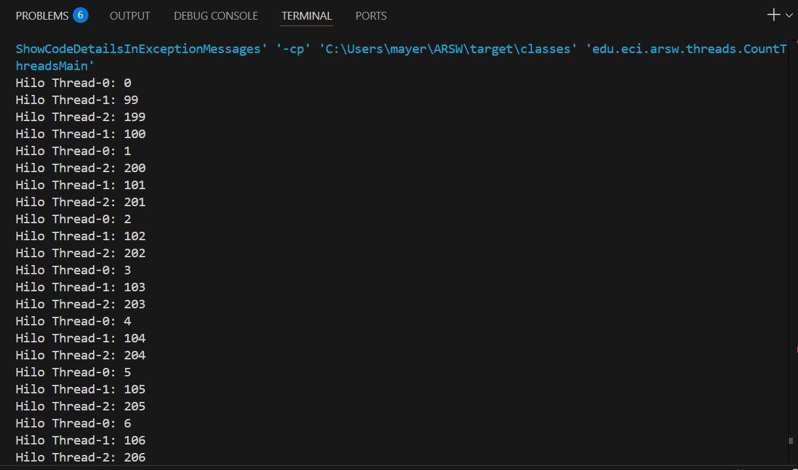
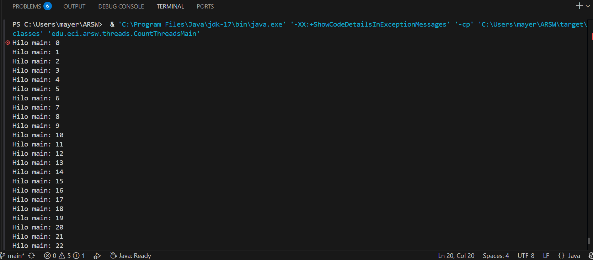

# **Introduction to Parallelism Exercise - Threads - BlackListSearch Case**

## **Description**

This exercise contains an introduction to threaded programming in Java, as well as its application to a specific case.

## **Authors**

- **Santiago Hurtado Martínez** [SantiagoHM20](https://github.com/SantiagoHM20)

- **Mayerlly Suárez Correa** [mayerllyyo](https://github.com/mayerllyyo)


#**Part I - Introduction to Threads in Java**

1. CountThread Class

    Complete the CountThread class so that it defines the life cycle of a thread that prints numbers between A and B.

    ```java
    public class CountThread extends Thread {
        private int startNum, endNum;

        public CountThread(int startNum, int endNum) {
            this.startNum = startNum;
            this.endNum = endNum;
        }

        @Override
        public void run() {
            for (int i = startNum; i <= endNum; i++) {
                System.out.printf("Thread %s: %d%n", 
                    Thread.currentThread().getName(), i);
            }
        }
    }
    ```

2. CountMainThreads Class
    1. Create three threads of type CountThread, assigning the first the range [0..99], the second [99..199], and the third [200..299].
    2. Start all three threads with 'start()'.
    3. Run them and review the output on the screen.
    4. Change the start with 'start()' to 'run()'. How does the output change? Why?

    **Implementation with start() method:**

    ```java
    public static void main(String a[]){
        CountThread ct1 = new CountThread(0, 99);
        CountThread ct2 = new CountThread(99, 199);
        CountThread ct3 = new CountThread(199, 299);

        ct1.start();
        ct2.start(); 
        ct3.start();    
        } 
    ```
    Output analysis using start() method:
    - Behavior: The threads execute concurrently (in parallel)
    - Output: Numbers from different threads are interleaved randomly
    - Execution: Each thread runs in its own execution context
    - Example output:
    


    **Implementation with run() method:**

    ```java
    public static void main(String a[]){
        CountThread ct1 = new CountThread(0, 99);
        CountThread ct2 = new CountThread(99, 199);
        CountThread ct3 = new CountThread(199, 299);

        ct1.run();
        ct2.run(); 
        ct3.run();    
        } 
    ```
    Output analysis using run() method:
    - Behavior: The methods execute sequentially (one after another)
    - Output: Numbers are printed in order: first 0-99, then 99-199, then 200-299
    - Execution: All code runs in the main thread
    - Example output:
    

    **Key differences**
    | Method | Execution | Thread Context | Performance | Use Case |
    |--------|-----------|----------------|-------------|----------|
    | start() | Concurrent | Separate threads | Potentially faster | True multithreading |
    | run() | Sequential | Main thread only | Single-threaded | Method call only |

    **Why this happens**
    - **start()**: Creates a new thread and calls run() in that new thread context
    - **run()**: Simply calls the method directly in the current thread (main thread)

    The start() method is the proper way to begin thread execution, while calling run() directly defeats the purpose of multithreading