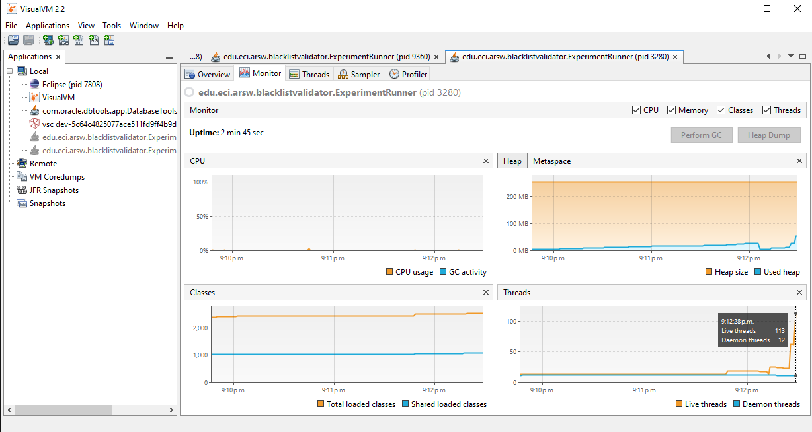

# **Introduction to Parallelism Exercise - Threads - BlackListSearch Case**

## **Description**

This exercise contains an introduction to threaded programming in Java, as well as its application to a specific case.

## **Authors**

- **Santiago Hurtado Martínez** [SantiagoHM20](https://github.com/SantiagoHM20)

- **Mayerlly Suárez Correa** [mayerllyyo](https://github.com/mayerllyyo)


### **Part I - Introduction to Threads in Java**

1. CountThread Class

    Complete the CountThread class so that it defines the life cycle of a thread that prints numbers between A and B.

    ```java
    public class CountThread extends Thread {
        private int num1, num2;

        public CountThread(int num1, int num2) {
            this.num1 = num1;
            this.num2 = num2;
        }

        public void printNumbers(int num1, int num2) {
            System.out.printf("num1 = %d, num2 = %d%n", num1, num2);
        }

        @Override
        public void run() {
            for (int i = num1; i <= num2; i++) {
                System.out.printf("Hilo %s: %d%n", Thread.currentThread().getName(), i);
                try {
                    Thread.sleep(500);
                } catch (InterruptedException e) {
                    System.out.println("El hilo fue interrumpido.");
                }
            }
        }
    }
    ```

2. CountMainThreads Class
    1. Create three threads of type CountThread, assigning the first the range [0..99], the second [99..199], and the third [200..299].
    2. Start all three threads with 'start()'.
    3. Run them and review the output on the screen.
    4. Change the start with 'start()' to 'run()'. How does the output change? Why?

    **Implementation with start() method:**

    ```java
    public static void main(String a[]){
        CountThread ct1 = new CountThread(0, 99);
        CountThread ct2 = new CountThread(99, 199);
        CountThread ct3 = new CountThread(199, 299);

        ct1.start();
        ct2.start(); 
        ct3.start();    
    } 
    ```
    Output analysis using start() method:
    - Behavior: The threads execute concurrently (in parallel)
    - Output: Numbers from different threads are interleaved randomly
    - Execution: Each thread runs in its own execution context
    - Example output:
    


    **Implementation with run() method:**

    ```java
    public static void main(String a[]){
        CountThread ct1 = new CountThread(0, 99);
        CountThread ct2 = new CountThread(99, 199);
        CountThread ct3 = new CountThread(199, 299);

        ct1.run();
        ct2.run(); 
        ct3.run();    
    } 
    ```
    Output analysis using run() method:
    - Behavior: The methods execute sequentially (one after another)
    - Output: Numbers are printed in order: first 0-99, then 99-199, then 200-299
    - Execution: All code runs in the main thread
    - Example output:
    

    **Key differences**
    | Method | Execution | Thread Context | Performance | Use Case |
    |--------|-----------|----------------|-------------|----------|
    | start() | Concurrent | Separate threads | Potentially faster | True multithreading |
    | run() | Sequential | Main thread only | Single-threaded | Method call only |

    **Why this happens**
    - **start()**: Creates a new thread and calls run() in that new thread context
    - **run()**: Simply calls the method directly in the current thread (main thread)

    The start() method is the proper way to begin thread execution, while calling run() directly defeats the purpose of multithreading

### **Part II - Introduction to Threads in Java**

For automatic security software, a component is being developed to validate IP addresses against several thousand known blacklists (of malicious hosts) and report those that exist in at least five of these lists. This component is designed according to the following diagram, where: HostBlackListsDataSourceFacade is a class that provides a 'facade' for querying any of the N registered blacklists (method 'isInBlacklistServer'), and also allows reporting to a local database when an IP address is considered hazardous. This class is NOT MODIFIABLE, but it is known to be 'Thread-Safe'.

HostBlackListsValidator is a class that provides the 'checkHost' method, which, through the 'HostBlackListDataSourceFacade' class, validates a specific host against each of the blacklists. This method considers the policy that if a HOST is found on at least five blacklists, it will be recorded as 'untrustworthy', or 'trustworthy' otherwise. Additionally, it will return the list of the numbers of the 'blacklists' where the HOST was found.


When using the module, the evidence that the registration was made as 'trustworthy' or 'not trustworthy' is given by the LOG messages: 

INFO: HOST 205.24.34.55 Reported as trustworthy 

INFO: HOST 205.24.34.55 Reported as NOT trustworthy 

The provided test program (Main) takes only a few seconds to analyze and report the provided address (200.24.34.55), as it is registered more than five times in the first servers, which means it doesn’t need to check all of them. However, searching in cases where there are NO reports, or where they are scattered across thousands of blacklists, takes quite a bit of time. 

This, like any search method, can be viewed as a embarrassingly parallel problem, as there are no dependencies between one partition of the problem and another. To 'refactor' this code and take advantage of the multi-core capability of the CPU of the machine, do the following:

Create a class of type Thread that represents the life cycle of a thread that searches for a segment of the available server set. Add a method to that class that allows you to 'ask' the instances of it (the threads) how many occurrences of malicious servers it has found or has found.

```java

package edu.eci.arsw.threads;

import java.util.*;
import java.util.concurrent.atomic.AtomicInteger;
import edu.eci.arsw.blacklistvalidator.*;
import edu.eci.arsw.spamkeywordsdatasource.*;

public class BlackListCheckerThread implements Runnable {
    private int start;
    private int end;
    private String ipAddress;
    private List<Integer> sharedOccurrences;
    private AtomicInteger totalOcurrences;
    private HostBlacklistsDataSourceFacade skds;


    public BlackListCheckerThread(int start, int end, String ipAddress,
        List<Integer> sharedOccurrences, AtomicInteger totalOcurrences) {
        this.start = start;
        this.end = end;
        this.ipAddress = ipAddress;
        this.sharedOccurrences = sharedOccurrences;
        this.totalOcurrences = totalOcurrences;
        this.skds = HostBlacklistsDataSourceFacade.getInstance();
    }

    @Override
    public void run() {
        for (int i = start; i < end && totalOcurrences.get() < HostBlackListsValidator.BLACK_LIST_ALARM_COUNT; i++) {
            if (skds.isInBlackListServer(i, ipAddress)) {
                sharedOccurrences.add(i);
                totalOcurrences.incrementAndGet();
            }
        }
    }
}
```

Add an integer parameter N to the 'checkHost' method, corresponding to the number of threads among which the search will be performed (remember to take into account whether N is even or odd!). Modify the code of this method so that it divides the search space into the indicated N parts, and parallelizes the search through N threads. Ensure that this function waits until all N threads finish solving their respective sub-problems, adds the occurrences found by each thread to the list returned by the method, and then calculates (by summing the total occurrences found by each thread) whether the number of occurrences is greater than or equal to BLACK_LIST_ALARM_COUNT. If this is the case, the host MUST be reported as reliable or unreliable at the end, and show the list with the numbers of the respective blacklists. To achieve this 'wait' behavior, check the join method of the Java concurrency API. Also, consider:

Within the method checkHost, the LOG must maintain information, before returning the result, about the number of blacklists checked vs. the total number of blacklists (line 60). It must be ensured that this information is accurate under the new proposed parallel processing scheme.

It is known that HOST 202.24.34.55 is reported in blacklists in a more scattered manner, and that host 212.24.24.55 is NOT on any blacklist.

```java
package edu.eci.arsw.blacklistvalidator;


public class HostBlackListsValidator {

    public static final int BLACK_LIST_ALARM_COUNT=5;
    
   
    public List<Integer> checkHost(String ipaddress, int numThread) {
    
        List<Integer> blackListOccurrences = Collections.synchronizedList(new ArrayList<>());
        List<Thread> threads = new ArrayList<>();
        
        HostBlacklistsDataSourceFacade skds = HostBlacklistsDataSourceFacade.getInstance();
        int totalServers = skds.getRegisteredServersCount();
        AtomicInteger totalOcurrences = new AtomicInteger(0);
    
        int serverPerThread = totalServers / numThread;
        int threadReminder = totalServers % numThread;
    
        int start = 0;
    
        for (int i = 0; i < numThread; i++) {
            int end = start + serverPerThread;
            if (i < threadReminder) {
                end++;
            }
    
            int threadStart = start;
            int threadEnd = end;
    
            Runnable task = new BlackListCheckerThread(threadStart, threadEnd, ipaddress, blackListOccurrences, totalOcurrences);
            Thread thread = new Thread(task);
            threads.add(thread);
            thread.start();
            start = end;
        }
    
        for (Thread t : threads) {
            try {
                t.join();
            } catch (InterruptedException e) {
                e.printStackTrace();
            }
        }
    
        if (totalOcurrences.get() >= BLACK_LIST_ALARM_COUNT) {
            skds.reportAsNotTrustworthy(ipaddress);
        } else {
            skds.reportAsTrustworthy(ipaddress);
        }
    
        LOG.log(Level.INFO, "Checked Black Lists: {0} of {1}",
                new Object[]{totalOcurrences.get(), skds.getRegisteredServersCount()});
    
        return blackListOccurrences;
    }
    
    private static final Logger LOG = Logger.getLogger(HostBlackListsValidator.class.getName());
}
```
### **Part II.I - Optimizing Parallel Search – Discussion**

The previously implemented parallelism strategy is inefficient in certain cases, as the search continues even when the N threads (together) have already found the minimum number of required occurrences to report to the server as malicious. How could the implementation be modified to minimize the number of queries in these cases? What new element would this bring to the problem?

#### Here, the use of interrupts is very useful. When a thread reaches the threshold, the others are interrupted to avoid calculations after the blocking condition is over.

#### In BlackListCheckerThread, an atomic boolean was added and used in this way:
```java
@Override
    public void run() {
        for (int i = start; i < end && !stopFlag.get(); i++) {
            if (skds.isInBlackListServer(i, ipAddress)) {
                sharedOccurrences.add(i);
                int current = totalOcurrences.incrementAndGet();
                if (current >= HostBlackListsValidator.BLACK_LIST_ALARM_COUNT) {
                    stopFlag.set(true);
                    break;
                }
            }
        }
    }
```

#### And in this way in HostBlackListValidator

```java
AtomicBoolean stopFlag = new AtomicBoolean(false);  
Runnable task = new BlackListCheckerThread(threadStart, threadEnd, ipaddress,
blackListOccurrences, totalOcurrences, stopFlag);
```

### **Part III - Performance Evaluation**

Based on the above, implement the following sequence of experiments to validate dispersed IP addresses (for example, 202.24.34.55), recording their execution times (make sure to run them on the same machine):

Single thread.
As many threads as processing cores (have the program determine this using the Runtime API).
As many threads as twice the number of processing cores.
50 threads.
100 threads.
When starting the program, run the jVisualVM monitor. As the tests run, review and record the CPU and memory usage in each case.

Using the above, and the given execution times, plot the solution time versus the number of threads. Analyze and formulate hypotheses with your partner for the following questions (you can consider what jVisualVM reports)

#### We created the class to experiment with monitoring

```java

public class ExperimentRunner {
    public static void main(String[] args) {
        String ip = "202.24.34.55";
        int cores = Runtime.getRuntime().availableProcessors();
        int[] threadCounts = {1, cores, cores * 2, 50, 100};

        System.out.println("Validación de IP: " + ip);
        System.out.println("Núcleos detectados: " + cores);
        System.out.println("========================================");
        System.out.printf("%-15s %-20s\n", "Hilos", "Tiempo (ms)");
        System.out.println("----------------------------------------");

        for (int threads : threadCounts) {
            HostBlackListsValidator validator = new HostBlackListsValidator();
            long start = System.currentTimeMillis();
            validator.checkHost(ip, threads);
            long end = System.currentTimeMillis();
            System.out.printf("%-15d %-20d\n", threads, (end - start));
        }
    }
}

```

#### This was the monitoring observed:




#### Which gave us this solution time vs threads graph as a result


#### The conclusion we draw is that as the number of threads increases, the solution time decreases, but this tends to an asymptote, so when a certain number of threads is reached, increasing them is no longer as efficient.

 ### **Part IV – Discussion: Amdahl’s Law**
 The final section analyzes why performance does not scale linearly with more threads:
- Why does performance plateau or decrease beyond a certain number of threads (e.g., 500)?

    Execution time decreases rapidly when the number of threads increases from a small baseline, but this improvement diminishes as the thread count grows. The curve eventually stabilizes around 50–100 threads. Beyond this range, adding more threads such as 500 introduces significant overhead in thread creation, scheduling, and synchronization, outweighing the benefits of parallelism. Additionally, Amdahl’s Law emphasizes that a non-parallelizable fraction of the algorithm sets an upper bound on performance. Consequently, performance plateaus and may even worsen with excessive threading.

- How does performance with threads equal to CPU cores compare to using double the cores?

    Using as many threads as physical CPU cores achieves good parallel utilization, but doubling the thread count (e.g., leveraging hyperthreading) still shows noticeable improvements. For example, going from 8 to 16 threads can cut execution time nearly in half from 25,000 ms to 12,000 ms. However, the speedup is not linear. Diminishing returns arise from shared resource contention, context switching, and synchronization overhead. While more threads than cores help to a point, they cannot achieve a perfect 2× scaling.

- How would the results change in a distributed environment across multiple machines?

    Distributing computation across multiple machines eliminates much of the overhead inherent in a single system. Running one thread per machine (e.g., 100 machines with 1 thread each) avoids local contention, context-switching overhead, and CPU-memory competition. The only additional cost is network communication when aggregating results. A hybrid setup—using c threads per machine across 100/c machines—can further optimize performance if c is kept at or below each machine’s optimal thread count. This strategy balances efficient local parallelism with global scalability, achieving better performance than saturating a single machine with hundreds of threads.